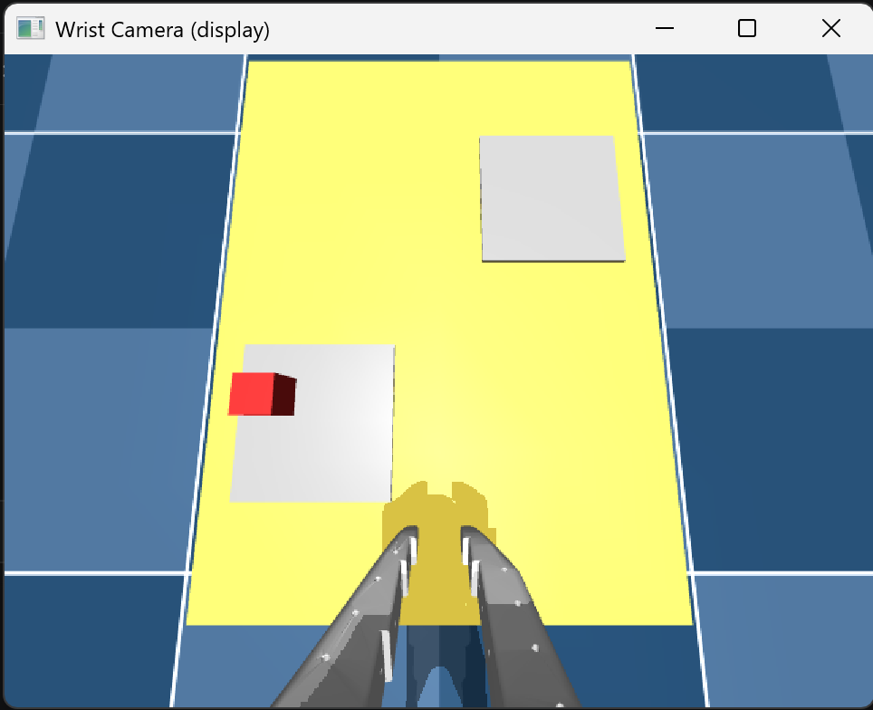
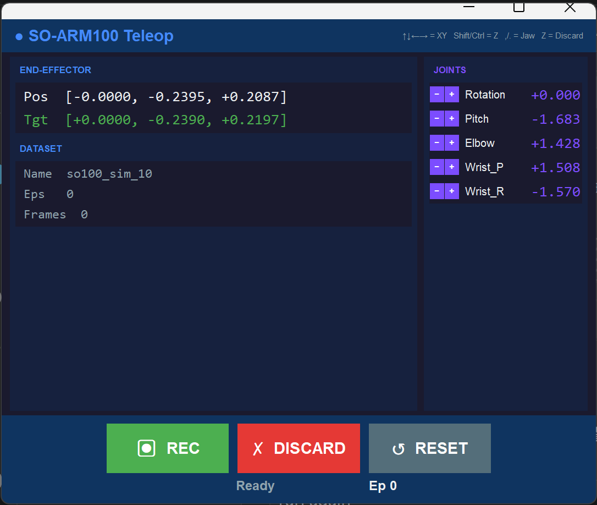

# SO-ARM100 Budget Pilot — Sim-to-Real Imitation Learning Pipeline

[](https://opensource.org/licenses/MIT)

SO-ARM100 robotic arm teleoperation & data collection in MuJoCo. Built as the simulation leg of a sim-to-real behavior cloning pipeline: human teleop → dataset recording → ACT/Diffusion training → real robot deployment.

Position-only IK + Hybrid Intuitive Frame + time interpolation. Dark theme tkinter UI. `.npz` + LeRobot v3 dataset recording.





## Why This Exists

Training visuomotor policies (ACT, Diffusion Policy, π₀, iFlyBot-VLA) requires **demonstration data** — sequences of (image, joint_state) → action pairs collected by humans performing tasks. This repo provides the simulation-side toolchain:

```
┌─────────────────────────────────────────────────────────────┐
│                    SO-ARM100 Budget Pilot                    │
│                                                             │
│  ┌──────────┐    ┌──────────┐    ┌────────────┐             │
│  │ Keyboard │───>│    IK    │───>│  MuJoCo     │             │
│  │ Teleop   │    │ (ikpy)   │    │  Sim       │             │
│  │          │    │ 20Hz DLS │    │            │             │
│  │ ↑↓←→     │    │ Pos-only │    │  SO-ARM100 │             │
│  │ Shift/Ctrl   │ 5-DOF    │    │  + Table   │             │
│  │ , . for jaw  │          │    │  + Cube    │             │
│  └──────────┘    └──────────┘    └─────┬──────┘             │
│                                        │                    │
│                          ┌─────────────┴─────────────┐      │
│                          │                           │      │
│                     Wrist Camera               Joint States │
│                     (640×480 RGB)            (6 DoF, deg)   │
│                          │                           │      │
│                          └──────────┬────────────────┘      │
│                                     │                       │
│                                     v                       │
│                          ┌──────────────────┐               │
│                          │  LeRobotDataset   │               │
│                          │  v3.0             │               │
│                          │                   │               │
│                          │  /data/*.parquet  │               │
│                          │  /videos/*.mp4    │               │
│                          │  /meta/           │               │
│                          └────────┬─────────┘               │
│                                   │                         │
└───────────────────────────────────┼─────────────────────────┘
                                    │
                                    v
┌─────────────────────────────────────────────────────────────┐
│                      Training (GPU)                          │
│                                                             │
│  lerobot-train --policy.type act --dataset.repo_id ...      │
│                                                             │
│  ┌──────────┐    ┌──────────────┐    ┌──────────────────┐   │
│  │   ACT    │    │  Diffusion   │    │  iFlyBot-VLA     │   │
│  │  (CVAE)  │    │  Policy      │    │  (Flow Matching) │   │
│  │  ~80M    │    │              │    │  ~2B             │   │
│  └──────────┘    └──────────────┘    └──────────────────┘   │
│                                                             │
└─────────────────────────────────────────────────────────────┘
```

**Research context**: This pipeline targets the same problem setting as [ACT](https://arxiv.org/abs/2304.13705) (CVAE + Action Chunking), [OpenVLA](https://arxiv.org/abs/2406.09246) (VLM→Action), [π₀](https://arxiv.org/abs/2410.24164) (Flow Matching VLA), and [iFlyBot-VLA](https://arxiv.org/abs/2511.01914) (dual-action representation). All of them start from human demonstration data — this is the tool that generates it.

## Quick Start

```bash
conda create -n so100 python=3.11 -y
conda activate so100
pip install -r requirements.txt

# Record a LeRobot dataset (★ recommended)
python demo_lerobot_record.py

# Or pick another program:
python demo_cam.py            # Wrist camera + MuJoCo viewer + .npz
python demo_basic.py          # Minimal teleop — tkinter + keyboard
python replay.py              # Replay recorded .npz trajectories
```

## Programs

| Program | Description | Data Output |
|---------|-------------|-------------|
| `demo_lerobot_record.py` | **★ Recommended** — teleop + LeRobotDataset v3 (MP4 + Parquet), draccus CLI | LeRobot v3 dataset |
| `demo_cam.py` | Wrist camera + MuJoCo viewer, dark theme UI | `.npz` |
| `demo_basic.py` | Basic teleop — tkinter panel + keyboard | `.npz` |
| `replay.py` | Trajectory player — scan `recordings/`, pick, replay with physics | — |
| `traj_viewer/` | Offline analysis — joint curves, EE 3D plot, arm animation | — |
| `hardware/` | SCS225 servo bridge — MuJoCo ↔ physical robot | — |

---

## demo_lerobot_record.py — LeRobot Dataset Recording ★

Keyboard teleop + direct LeRobotDataset v3 recording. Produces MP4 video + Parquet joint data, ready for ACT / Diffusion Policy / VLA training. All parameters configurable via draccus CLI.

### Quick Run

```bash
python demo_lerobot_record.py                          # Default: 10 FPS, ±3cm cube random
python demo_lerobot_record.py --record_fps 20          # 20 FPS
python demo_lerobot_record.py --cube_random_xy 0.05    # Wider cube randomization (±5cm)
python demo_lerobot_record.py --help                   # Show all options
```

### CLI Options

```bash
--record_fps 20               # Recording FPS (default 10)
--cube_random_xy 0.05         # Cube XY randomization range in meters (default 0.03)
--pos_speed 0.15              # EE move speed (m/s, default 0.10)
--episode_max_duration 60.0   # Auto-stop after N seconds (default 120)
--target_episodes 50          # Auto-quit after N episodes (default 0 = indefinite)
--dataset_root datasets/my_data  # Custom dataset path
--wrist_width 640             # Wrist camera width
--wrist_height 480            # Wrist camera height
```

### Workflow

1. Press **⏺ REC** → recording starts
2. Keyboard-teleop the arm (pick → move → place)
3. Press **⏹ STOP** → episode saved, arm resets to home, cube randomized
4. Press **✗ DISCARD** (or `Z`) to dump a bad episode
5. Repeat → `Q` / `ESC` to quit

Each run auto-increments the dataset directory (`so100_sim_1`, `_2`, …). No overwrites.

### Keyboard Controls

| Key | Action |
|-----|--------|
| ↑↓←→ | EE XY move (Hybrid Intuitive Frame) |
| Shift / Ctrl | EE Z up / down |
| `,` / `.` | Jaw close / open |
| `Z` | Discard current episode |
| `Q` / `ESC` | Quit |

### Output Format (LeRobot v3)

```
datasets/so100_sim_N/
├── data/
│   └── chunk-000/
│       └── episode_000000.parquet   # state + action, per-frame
├── videos/
│   └── observation.images.wrist/
│       └── episode_000000.mp4       # wrist camera, H.264
└── meta/
    ├── info.json                    # fps, features, total_episodes
    ├── stats.json                   # normalization stats (compute_stats)
    └── tasks.parquet                # task index
```

**Features recorded**:

| Feature | Shape | Description |
|---------|-------|-------------|
| `observation.state` | (6,) float32 | Joint angles in degrees |
| `action` | (6,) float32 | Target joint angles in degrees |
| `observation.images.wrist` | (480, 640, 3) uint8 | Wrist camera RGB |

Cube XY randomized ±3cm on each episode reset for data diversity. Format is directly compatible with `lerobot-train`.

### Training

```bash
# Generate stats
python -c "
from lerobot.datasets.factory import make_dataset
from lerobot.datasets.compute_stats import compute_stats
dataset = make_dataset(repo_id='budget_pilot/datasets/so100_sim_1')
stats = compute_stats(dataset, num_workers=0, batch_size=8)
stats.save('budget_pilot/datasets/so100_sim_1/stats.json')
"

# Train ACT
lerobot-train \
    --dataset.repo_id "budget_pilot/datasets/so100_sim_1" \
    --policy.type act \
    --output_dir outputs/so100_act \
    --steps 50000 \
    --batch_size 8
```

---

## Core Architecture

All programs share the same control engine:

- **Position-only IK** — 3 constraints on 5 DOF, damped least squares via [ikpy](https://github.com/Phylliade/ikpy). 20 Hz re-solving. Orientation left unconstrained (no drift in practice).
- **Time interpolation** — IK targets linearly smoothed over 50 ms. No joint snapping.
- **Hybrid Intuitive Frame** (ICRA 2024) — Forward = ground-projected gripper Z. Directions always intuitive regardless of arm pose.
- **Single-loop + dt-scaled** — Physics and control in one `while` loop. EE speed constant, immune to frame-rate jitter.

---

## `hardware/` — SCS225 Servo Bridge

Bridges the MuJoCo simulation to physical SCS225 servos via the driver board.

| Program | Direction | Description |
|---------|-----------|-------------|
| `hardware/demo_cam_servo.py` | MuJoCo → Servo | Keyboard teleop + servo tracking |
| `hardware/demo_servo_track.py` | MuJoCo → Servo | LeRobot recording + servo tracking |
| `hardware/demo_servo_mirror.py` | Servo → MuJoCo | Passive backdriving — twist servo, MuJoCo follows |

```bash
python hardware/demo_cam_servo.py      # MuJoCo controls servo
python hardware/demo_servo_mirror.py    # Servo controls MuJoCo (torque-off)
```

### Control Features

- **max_relative_target**: 30 steps/frame cap — prevents dangerous jumps on reset
- **Velocity feedforward**: auto-adjusts servo speed based on displacement
- **Periodic readback**: verifies tracking accuracy every 500ms
- **50Hz sync rate**: balanced between smoothness and bus load

### Wiring

```
PC → USB → Driver Board → TTL Bus → SCS225 Servo(s)
                                    ├─ White: Signal
                                    ├─ Red:   VCC (6-8.4V independent)
                                    └─ Black: GND
```

### Servo Specs (Measured)

| Metric | Value |
|--------|-------|
| Steady-state precision | ±2 steps (±0.6°) |
| Single ReadPos latency | ~443μs |
| 6-servo serial read | ~2.7ms (16% of 60Hz frame) |
| SyncWrite support | ✅ |
| SyncRead support | ❌ (SCS protocol v1) |

---

## `traj_viewer/` — Trajectory Analysis

Offline visualization for `.npz` recordings (from `demo_cam.py` / `demo_basic.py`). Does NOT work with LeRobot datasets — use `lerobot-dataset-viz` for those.

```bash
python traj_viewer/main.py                    # GUI — browse & pick
python traj_viewer/main.py <file.npz>         # CLI — quick stats dump
```

**Features**: joint angle curves, EE 3D trajectory, arm animation, multi-trajectory compare, statistics popup.

---

## Requirements

- Python ≥ 3.10
- MuJoCo ≥ 3.0
- ikpy ≥ 3.4
- NumPy ≥ 1.26
- opencv-python ≥ 4.0
- tkinter (bundled with Python)
- [lerobot](https://github.com/huggingface/lerobot) — for `demo_lerobot_record.py`
- [draccus](https://github.com/dlwh/draccus) — for `demo_lerobot_record.py`
- pandas, av, scipy

---

## File Structure

```
so100-budget-pilot/
├── demo_lerobot_record.py     # ★ Recommended — teleop + LeRobot dataset
├── demo_cam.py                # Wrist camera + MuJoCo viewer + .npz
├── demo_basic.py              # Basic teleop
├── replay.py                  # Trajectory replay with picker (.npz)
├── traj_viewer/               # Offline analysis tool
├── hardware/                  # SCS225 servo control (MuJoCo ↔ hardware)
│   ├── demo_cam_servo.py      #   Keyboard teleop + servo tracking
│   ├── demo_servo_track.py    #   LeRobot record + servo tracking
│   └── demo_servo_mirror.py   #   Servo → MuJoCo mirror (leader mode)
├── so100_fk.py                # Forward kinematics (pure NumPy)
├── so100_ik.py                # Inverse kinematics (ikpy DLS)
├── requirements.txt
├── model/
│   ├── so100_pick_place.xml   # MuJoCo scene (table + cube)
│   ├── so_arm100.xml          # SO-ARM100 robot model
│   └── assets/                # Mesh files (.stl)
├── recordings/                # Saved .npz trajectories
└── datasets/                  # LeRobot datasets (gitignored)
```

## References

- [ACT: Learning Fine-Grained Bimanual Manipulation with Low-Cost Hardware](https://arxiv.org/abs/2304.13705) — Zhao et al., 2023
- [What Matters in Learning from Offline Human Demonstrations](https://arxiv.org/abs/2108.03298) — Mandlekar et al., 2021
- [OpenVLA: An Open-Source Vision-Language-Action Model](https://arxiv.org/abs/2406.09246) — Kim et al., 2024
- [π₀: A Vision-Language-Action Flow Model for General Robot Control](https://arxiv.org/abs/2410.24164) — Black et al., 2024
- [iFlyBot-VLA Technical Report](https://arxiv.org/abs/2511.01914) — Zhang et al., 2025
